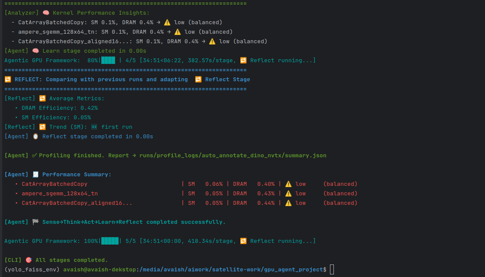

🧠 gpu-agent-opt

Unified AI Agent Framework for GPU Kernel Profiling, Scientific Computing, and CUDA Exploration

gpu-agent-opt is a Python package designed to orchestrate AI-style agentic workflows for Triton, CUDA, CuPy, cuDF, and advanced GPU programming patterns — combining automatic kernel discovery, profiling, and analysis with a knowledge-driven loop:

👉 Sense → Think → Act → Learn → Reflect

The current focus is to build a one-stop GPU research & profiling layer that integrates deep learning graph compilers (PyTorch Inductor / XLA), scientific computing (CuPy / cuDF), and low-level CUDA primitives (e.g., coalesced memory, warp shuffle, tensor cores) into a single agentic profiling system.

✨ Core Capabilities

🧠 Agentic Kernel Profiler

Automatically discovers active GPU kernels during script execution using Nsight Systems.

Selects top kernels (based on occurrence or time) for detailed Nsight Compute profiling.

Generates structured summary reports (JSON) with SM and DRAM efficiency metrics.

🧪 Multi-Backend Context

Triton kernels (via PyTorch Inductor or custom)

Raw CUDA kernels (via NVRTC / PyCUDA / C++ extensions)

CuPy & cuDF for scientific array/dataframe computing

Planned: CUDA Graphs, Cooperative Groups, Tensor Cores, async copies, MIG partitioning.

🔬 Profiler Integration

Nsight Systems for kernel discovery.

Nsight Compute for profiling top kernels with selected metrics (e.g., sm__throughput, dram__throughput).

Generates both per-kernel CSVs and aggregated summary.json.

📚 Knowledge Base / Reflection

reflect_history.json stores efficiency trends over multiple runs.

Helps identify consistently low-performing kernels and track improvements over time.

🛰 Target Use Cases

Geospatial AI auto-annotation pipelines (DINOv2, SAM2, YOLO, NDWI/LBP preprocessing)

Deep learning inference/training profiling through PyTorch + Nsight

Scientific/HPC workloads (FFT, FDTD3D, conjugate gradient, Monte Carlo, etc.)

CUDA educational benchmarking (transpose, reduction, memory hierarchy, etc.)

Embedded GPU pipelines (Jetson Orin / RB5).

📊 🧠 Agentic Profiling Snapshot

The framework executes a five-stage loop to profile real GPU workloads:

Sense → Discover kernels
Think → Select top kernels
Act → Run Nsight Compute on selected kernels
Learn → Analyze & classify bottlenecks
Reflect → Track efficiency trends over runs

## 📊 Example output from profiling a geospatial annotation pipeline

Below is a snapshot from a real profiling run on DINOv2 + SAM2 annotation pipeline:

These metrics are stored in:

runs/profile_logs/.../summary.json → per-run aggregated metrics

reflect_history.json → longitudinal trend tracking (e.g., average SM & DRAM efficiency per run)

This forms the foundation for future agentic steps, such as:

Replacing inefficient PyTorch kernels with custom CUDA/Triton implementations

Adjusting launch configurations or fusing operators

Triggering code generation agents

🔥 CUDA Samples Integration

The agent aims to provide a Pythonic exploration layer over classic CUDA patterns, using the official CUDA Samples as a baseline:

Memory & Data Movement: bandwidthTest, transpose, globalToShmemAsyncCopy, etc.

Computation Kernels: reduction, scan, GEMM tensor core examples.

Advanced Features: CUDA Graphs, Cooperative Groups, Async API.

Linear Algebra & Solvers: cuBLAS, cuSolver.

Signal & Image Processing: FFT (CUFFT), DCT, NPP.

Misc: deviceQuery, inlinePTX, cudaOpenMP, NVRTC runtime compilation.

All these are being wrapped progressively into Python interfaces and integrated with the profiler for analysis and future optimization.

🧪 Scientific + DL Interoperability

CuPy / cuDF kernels can be profiled alongside Triton / CUDA kernels in the same pipeline.

PyTorch Inductor graphs can be analyzed to identify candidate subgraphs for replacement.

Target: seamlessly combine high-level deep learning graphs with low-level profiling data.

📦 Installation

👉 https://test.pypi.org/project/gpu-agent-opt/

pip install gpu-agent-opt

Development install:

git clone https://github.com/intelav/gpu_agent_opt.git
cd gpu_agent_opt
pip install -e .

📊 Roadmap

✅ Triton kernel detection through Inductor

✅ Nsight Systems + Compute integration

✅ Summary & Reflect history JSON generation

🚧 CuPy / cuDF scientific profiling

🚧 CUDA Samples wrapping

🚧 Tensor Core profiling

🚧 Multi-GPU / MIG profiling

🚧 Autotuning (Triton / CUDA) — future

🚧 Web dashboard for kernel search spaces & profiling results

🤝 Contributing

Contributions are very welcome, especially for:

Wrapping additional CUDA samples into Python bindings

Expanding scientific kernel coverage (FFT, solvers, etc.)

Profiling backends (CUPTI integration, Nsight scripting)

Building autotuning hooks (Triton, CUDA extensions)

👉 Open issues & PRs on GitHub

📜 License

MIT License — see LICENSE