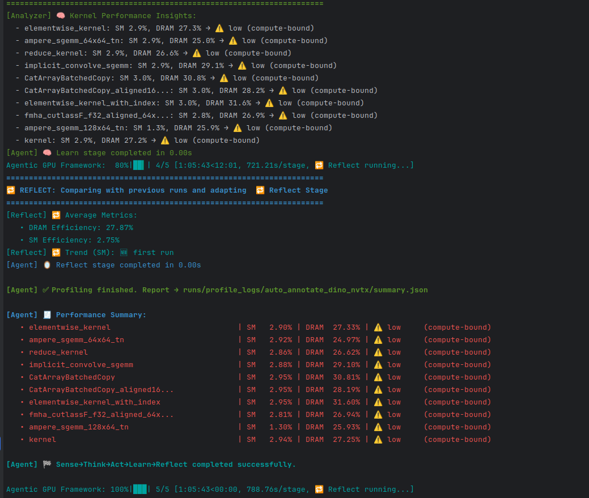

# 🧠 **gpu-agent-opt**

**Unified AI Agent Framework for GPU Kernel Profiling, Scientific Computing, and CUDA Exploration**

`gpu-agent-opt` is a Python package designed to orchestrate **agentic workflows** for **Triton, CUDA, CuPy, cuDF**, and advanced GPU programming patterns — combining **kernel discovery**, **profiling**, and **analysis** with a knowledge-driven loop:

👉 **Sense → Think → Act → Learn → Reflect**

The current focus is to build a **one-stop GPU research & profiling layer** that integrates:
- Deep learning graph compilers (PyTorch Inductor / XLA)  
- Scientific computing (CuPy / cuDF)  
- Low-level CUDA primitives (e.g., coalesced memory, warp shuffle, tensor cores)

---

## ✨ **Core Capabilities**

### 🧠 Agentic Kernel Profiler
- Discovers active GPU kernels during script execution using **Nsight Systems**.  
- Selects top kernels for detailed **Nsight Compute** profiling.  
- Generates structured summary reports (JSON) with SM and DRAM efficiency metrics.

### 🧪 Multi-Backend Context
- ✅ **Triton kernels** (via PyTorch Inductor or custom)  
- ✅ **Raw CUDA kernels** (NVRTC / PyCUDA / C++ extensions)  
- ✅ **CuPy & cuDF** scientific kernels  
- 🚧 **Planned:** CUDA Graphs, Cooperative Groups, Tensor Cores, async copies, MIG.

### 🔬 Profiler Integration
- Nsight Systems → Kernel discovery  
- Nsight Compute → Per-kernel profiling (SM & DRAM metrics)  
- Exports both per-kernel CSV and aggregated `summary.json`.

### 📚 Knowledge Base / Reflection
- `reflect_history.json` stores efficiency trends across runs.  
- Helps identify consistently low-performing kernels over time.

---

## 🛰 **Target Use Cases**
- Geospatial AI auto-annotation pipelines (DINOv2, SAM2, YOLO, NDWI/LBP preprocessing)  
- Deep learning inference/training profiling through PyTorch + Nsight  
- Scientific/HPC workloads (FFT, FDTD3D, conjugate gradient, Monte Carlo, etc.)  
- CUDA educational benchmarking (transpose, reduction, memory hierarchy, etc.)  
- Embedded GPU pipelines (Jetson Orin / RB5)

---

## 📊 **Agentic Profiling Snapshot**

The framework executes a **five-stage loop** to profile real GPU workloads:

| Stage   | Description                     |
|---------|----------------------------------|
| Sense   | Discover kernels                |
| Think   | Select top kernels              |
| Act     | Profile with Nsight Compute     |
| Learn   | Analyze & classify bottlenecks |
| Reflect | Track efficiency trends        |

### 📸 Example output from profiling a geospatial annotation pipeline

Below is a snapshot from a real profiling run on DINOv2 + SAM2:



The results are stored in:

- `runs/profile_logs/.../summary.json` → per-run aggregated metrics  
- `reflect_history.json` → longitudinal trend tracking

These form the basis for future **agentic actions**, such as:
- Replacing inefficient PyTorch kernels with custom CUDA/Triton implementations
- Adjusting launch configurations or fusing operators
- Triggering code-generation agents

---

## 🔥 **CUDA Samples Integration**

The agent provides a Pythonic layer over classic CUDA patterns (via official samples):

- **Memory & Data Movement**  
  `bandwidthTest`, `transpose`, `globalToShmemAsyncCopy`, `UnifiedMemoryStreams`

- **Computation Kernels**  
  `reduction`, `scan`, GEMM tensor core examples

- **Advanced Features**  
  CUDA Graphs, Cooperative Groups, Async API

- **Linear Algebra & Solvers**  
  cuBLAS, cuSolver

- **Signal & Image Processing**  
  CUFFT, DCT, NPP routines

- **Miscellaneous / Educational**  
  `deviceQuery`, `inlinePTX`, `cudaOpenMP`, NVRTC runtime compilation

---

## 🧪 **Scientific + DL Interoperability**

- CuPy / cuDF kernels can be profiled alongside Triton / CUDA kernels.  
- PyTorch Inductor graphs can be analyzed to identify subgraphs for replacement.  
- Goal: Combine **high-level DL graphs** with **low-level profiling data**.

---

## 📦 **Installation**

**TestPyPI**:  
👉 [https://test.pypi.org/project/gpu-agent-opt/](https://test.pypi.org/project/gpu-agent-opt/)

```bash
pip install gpu-agent-opt
